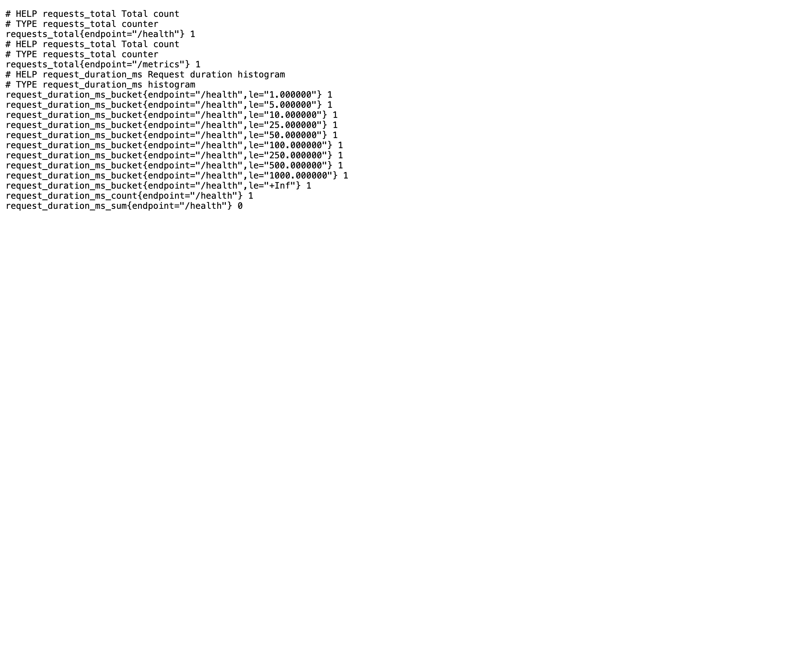
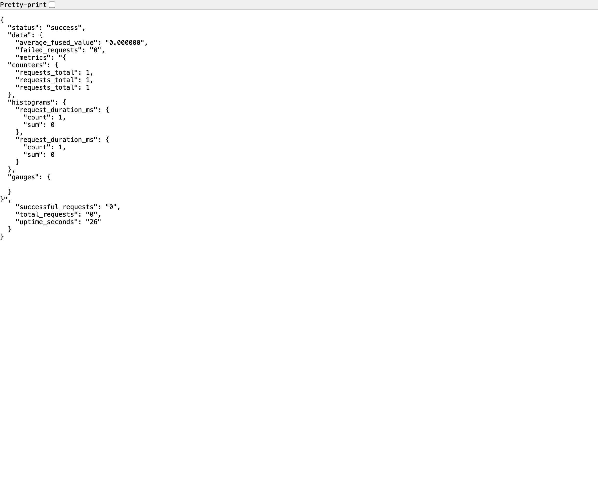
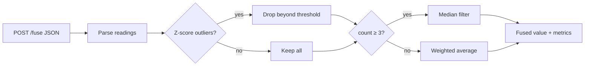

# cpp-telemetry-fuser

[](https://github.com/chaffybird56/cpp-telemetry-fuser/actions/workflows/ci.yml)
[](https://en.cppreference.com/w/cpp/17)
[](LICENSE)
[](tests/)

**Which sensor reading do you trust?** POST a batch of telemetry samples and get one fused value — with outlier rejection, Prometheus metrics, and a production-style HTTP surface.

> **Layers 1–4:** C++17 service core → threaded HTTP server → GitHub Actions CI (sanitizers, coverage) → Docker image + load-test gate.

<p align="center">
  
</p>

| Clean fusion | Outlier rejected |
|---|---|
|  | `50.0` in `[12.1, 11.9, 12.0, 12.2, 50.0]` → filtered → fused **12.10** from the four in-band samples. |
| Four agreeing sensors → stable fused value and `input_count` preserved in `/stats`. | Spike beyond **3σ** (configurable) dropped before median / weighted-average fusion. |

## At a glance

| | |
|---|---|
| **Problem** | Multiple sensors report the same quantity; one channel drifts, spikes, or fails. |
| **Approach** | Z-score outlier gate → median (≥3 samples) or weighted average → single fused reading per request. |
| **Why not “just average”?** | A single bad sample skews the mean; outlier detection keeps the fused value representative of the healthy cluster. |
| **Stack** | C++17 · custom HTTP server · header-only JSON/logging · Prometheus metrics · GoogleTest · Docker multi-stage |

## API surface

| Endpoint | Method | Role |
|----------|--------|------|
| `/health` | GET | Liveness + version |
| `/fuse` | POST | Fuse `{"readings":[...]}` → fused value |
| `/metrics` | GET | Prometheus text exposition |
| `/stats` | GET | JSON request / fusion counters |
| `/config` | GET/POST | Runtime outlier threshold & flags |

**Example**

```bash
curl -s -X POST http://localhost:8080/fuse \
  -H 'Content-Type: application/json' \
  -d '{"readings":[12.1,11.9,12.0,12.2,50.0]}'
```

```json
{
  "status": "success",
  "data": {
    "fused_value": "12.100000",
    "input_count": "5",
    "timestamp": "1760328512635"
  }
}
```

## How it works


```mermaid
flowchart LR
  A[POST /fuse JSON] --> B[Parse readings]
  B --> C{Z-score outliers?}
  C -->|yes| D[Drop beyond threshold]
  C -->|no| E[Keep all]
  D --> F{count ≥ 3?}
  E --> F
  F -->|yes| G[Median filter]
  F -->|no| H[Weighted average]
  G --> I[Fused value + metrics]
  H --> I
```

1. **Ingress** — HTTP worker threads accept JSON bodies on `/fuse`.  
2. **Outlier gate** — samples farther than `outlier_threshold` standard deviations from the mean are removed (when enabled and `n > 2`).  
3. **Fusion** — median for robustness at ≥3 points; weighted average for small sets.  
4. **Observability** — counters, histograms, and `/stats` updated atomically; `/metrics` exposes Prometheus format.

## Quick start

### Layer 1 — build & unit test

```bash
git clone https://github.com/chaffybird56/cpp-telemetry-fuser.git
cd cpp-telemetry-fuser
cmake -S . -B build -G Ninja && cmake --build build
ctest --test-dir build --output-on-failure
```

### Layer 2 — run locally

```bash
./build/cpp-service --port 8080

curl http://localhost:8080/health
curl -s -X POST http://localhost:8080/fuse \
  -H 'Content-Type: application/json' \
  -d '{"readings":[12.1,11.9,12.0,12.2]}'
curl http://localhost:8080/metrics
```

### Layer 3 — interactive demo

```bash
./demo.sh
```

Exercises health, fuse (normal + outlier), metrics, stats, config, and a short `hey` load burst.

### Layer 4 — container & load gate

```bash
docker build -t cpp-telemetry-fuser:latest -f docker/Dockerfile .
docker run --rm -p 8080:8080 cpp-telemetry-fuser:latest

# optional load test (hey)
hey -z 15s -c 100 -m POST \
  -H "Content-Type: application/json" \
  -d '{"readings":[12.1,11.9,12.0]}' \
  http://localhost:8080/fuse
```

## Runtime configuration

Tune fusion without recompiling:

```bash
curl http://localhost:8080/config
curl -X POST http://localhost:8080/config \
  -H 'Content-Type: application/json' \
  -d '{"outlier_threshold":3.0,"enable_outlier_detection":true}'
```

| Field | Default | Effect |
|-------|---------|--------|
| `outlier_threshold` | `3.0` | Z-score cutoff for outlier rejection |
| `enable_outlier_detection` | `true` | Toggle filter stage |
| `min_confidence` | `0.8` | Confidence gate for fusion path |

## Validation (automated)

`ctest` and CI exercise the same gates locally and on push.

| Gate | Result | Notes |
|------|--------|-------|
| Service logic (12 tests) | PASS | Fusion, outliers, config, stats |
| Metrics system (12 tests) | PASS | Counters, histograms, gauges, timers |
| Integration / HTTP | PASS | Endpoints, JSON contracts |
| ASan + UBSan (CI) | PASS | Memory & UB checks on Ubuntu |
| Docker build (CI) | PASS | Multi-stage image |

Representative load (Apple M3 Pro, `./demo.sh` / `hey -z 15s -c 100`):

| Metric | Value |
|--------|-------|
| Throughput | ~13k–22k req/s |
| Latency P50 | ~0.8 ms |
| Latency P99 | ~32 ms |
| Error rate | 0% |

## Tests

| Gate | Purpose |
|------|---------|
| `ctest --test-dir build --output-on-failure` | All 24 GoogleTest cases |
| `./demo.sh` | End-to-end HTTP walkthrough + load snippet |
| `hey` / `tools/loadgen/run_hey.sh` | Throughput & latency distribution |
| `.github/workflows/ci.yml` | Build, test, sanitizers, coverage, Docker |

**CI (Layer 3):** [GitHub Actions](.github/workflows/ci.yml) runs build + test, Address/Undefined sanitizers, coverage upload, clang-tidy, and a Docker image build on every push to `main` / `develop`.

## Documentation

| Path | Contents |
|------|----------|
| [TESTING_ANALYSIS.md](TESTING_ANALYSIS.md) | Methodology, fixture detail, load-test notes |
| [demo.sh](demo.sh) | Scripted Layer 3 demo |
| [docker/Dockerfile](docker/Dockerfile) | Multi-stage runtime image (~126 MB) |
| [screenshots/](screenshots/) | Captured metrics/stats artifacts |

## Roadmap

- [x] Layer 1 — C++17 fusion core + 24 unit tests
- [x] Layer 2 — Threaded HTTP server (`/health`, `/fuse`, `/metrics`, `/stats`, `/config`)
- [x] Layer 3 — GitHub Actions (build, sanitizers, coverage, Docker)
- [x] Layer 4 — `demo.sh` + load-gen tooling + container publish path
- [x] Prometheus-compatible `/metrics` exposition
- [ ] gRPC ingress alongside HTTP
- [ ] Persistent stats backend (SQLite / Redis)
- [ ] OpenTelemetry trace export

<details>
<summary>Technical depth — layout & request path</summary>

```
src/                    main, service, metrics, http_server
include/                Public headers + config.h.in
tests/                  service_tests, metrics_tests, integration_tests
third_party/            Header-only JSON, HTTP, logging
docker/                 Multi-stage Debian slim image
tools/loadgen/          hey/wrk helpers + latency plots
.github/workflows/      ci.yml
demo.sh                 Layer 3 orchestration
```

- **HTTP:** `http_server.cpp` — accept loop, per-connection workers, route table to service handlers.  
- **Fusion:** `service.cpp` — mean/σ outlier detect → `median_filter` or `weighted_average`; stats via `std::atomic`.  
- **Metrics:** `metrics.cpp` — Prometheus text format; thread-safe counters/histograms.  
- **Build:** CMake + Ninja; GoogleTest fetched at configure time; `-Wall -Wextra` via `cmake/Warnings.cmake`.  
- **Container:** non-root `cppservice` user, health check on `/health`, ARM64-friendly slim runtime.

</details>

MIT — see [LICENSE](LICENSE).
